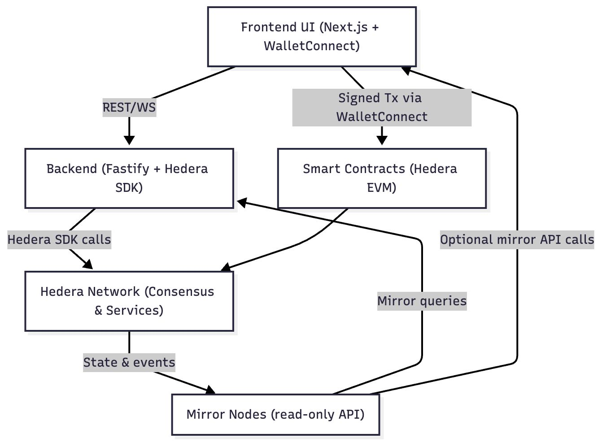

# Evolt Monorepo: Fractionalized RWA on Hedera for the World 🌐

> **Evolt** is a **blockchain-powered investment platform** dedicated to democratizing access to **Real World Assets (RWA)**. We enable users to own fractionalized shares of assets including **real estate, creator IP, agriculture, and private credit** directly via **WhatsApp** or a dedicated web dApp.
>
> **Built for the Hedera Hackathon**, this monorepo consolidates our core applications:
>
> 1. **Backend:** A robust **Fastify** API leveraging the **Hedera SDK** for all blockchain interactions.
> 2. **Frontend:** A user-friendly **Next.js** dApp and our **WhatsApp Cloud API** integration.

---

## 🏗️ Monorepo Structure

This project uses **NPM Workspaces** for a cohesive monorepo setup:

```markdown
evolt/
├── apps/
│ ├── evolt-be/    # ⚡ Fastify + TypeScript backend (Hedera SDK integration)
│ └── evolt-fe/    # 💻 Next.js frontend (dApp & WalletConnect)
├── package.json   # Root workspace configuration
└── README.md      # This file
```

---

## 🛠️ Technology Stack (Hedera Focus)

Evolt is built on a modern, high-performance stack, with **Hedera Hashgraph** at its core for speed, security, and low fees.

| Layer | Technology | Key Use / Notes |
| :--- | :--- | :--- |
| **Blockchain** | **Hedera Hashgraph** | Fast, final, and secure ledger for RWA tokenization. |
| **Backend** | Fastify 5, **Hedera SDK**, TypeScript | High-throughput API gateway for Hedera interactions (HCS, HTS, Smart Contracts). |
| **Frontend** | Next.js 15, Tailwind CSS, WalletConnect | Blazing-fast dApp with multi-wallet support. |
| **Messaging** | **WhatsApp Cloud API** | Enables RWA fractional trading/reporting directly via the world's most popular messaging app. |
| **Database** | MongoDB (Atlas) | Flexible, scalable data storage. |
| **Queueing** | BullMQ + Redis | Reliable, transactional queue for handling Hedera consensus/mirror node updates. |
| **Storage/Security** | Azure Blob Storage + Key Vault | Secure storage for KYC documents and secret management. |
| **AI (Optional)** | OpenAI GPT-4o / GPT-5 | Future integration for sophisticated investment analysis or conversational trading bots. |

---

## 💡 Evolt Architecture: Hedera Flow

The Evolt platform leverages a hybrid architecture to combine the speed and trust of the Hedera network with the flexibility of a traditional API, supporting both programmatic (API) and direct-wallet (dApp) interactions.



### Key Interaction Flows

1.**Read Operations (Data Retrieval):**

* The **Frontend UI** requests non-critical, historical, or display-only data directly from the **Mirror Nodes** via optional API calls.
* The **Backend** also uses **Mirror Queries** to gather state and transaction history that originates from the **Hedera Network**.

2.**Backend-Initiated Transactions (Platform Services):**

* The **Frontend UI** communicates with the **Backend** via **REST/WS** for off-chain actions (like user auth, KYC, or internal state updates).
* The **Backend** uses the **Hedera SDK** to execute Hedera-specific transactions (e.g., token issuance, compliance checks, data logging to HCS).

3.**User-Initiated On-Chain Transactions (Trading/Transfer):**

* For actions requiring a user signature (e.g., purchasing a fractional RWA token), the **Frontend UI** facilitates a **Signed Transaction** via **WalletConnect**.
* This transaction is submitted directly to the **Smart Contracts (Hedera EVM)** for execution against our escrow/token contracts.

4.**State Synchronization:**

* All transactions submitted to the **Hedera Network (Consensus & Services)** result in **State & Events**.
* These events are reliably indexed by the **Mirror Nodes**, ensuring all parts of the application have access to the final, consistent state of RWA token ownership and balances.

---

## 🚀 Quick Start: Setup Instructions

Follow these steps to get the Evolt platform running on your local machine.

### 1️⃣ Clone and Navigate

```bash
git clone <your-monorepo-url> evolt
cd evolt
```

### 2️⃣ Install Dependencies

From the root directory, install all workspace dependencies:

```bash
yarn install
```

### 3️⃣ Environment Configuration

Create the necessary configuration files and populate them with your secrets and credentials.

#### **Backend (`apps/evolt-be/.env`)**

```ini
# ─── General ───
DATABASE_URL=mongodb+srv://<user>:<password>@cluster.mongodb.net/evolt
JWT_SECRET=your_jwt_secret

# ─── Redis ────
UPSTASH_REDIS_URL=redis://...

# ─── Azure Storage ───
AZURE_STORAGE_CONNECTION_STRING=DefaultEndpointsProtocol=...
AZURE_STORAGE_CONTAINER=kyc-documents
AZURE_KEY_VAULT_URI=https://ev-wallet-kv.vault.azure.net/
KV_WRAP_KEY_NAME=ev-wrap-key

# ─── Hedera Network ──── (Testnet or Mainnet Configuration)
HEDERA_OPERATOR_ID=0.0.xxxxxxx
HEDERA_OPERATOR_KEY=302e02...
HEDERA_RPC_URL=https://testnet.hashio.io/api
HEDERA_MIRROR_NODE_URL=https://testnet.mirrornode.hedera.com/api
HEDERA_VUSD_TOKEN_ID=0.0.7029847
HEDERA_USDC_TOKEN_ID=0.0.7098968
HEDERA_USDT_TOKEN_ID=0.0.7098970
VOLT_ESCROW_CONTRACT_ID=0.0.123789

# ─── WhatsApp Cloud API ────────
WHATSAPP_TOKEN=<your_meta_token>
WHATSAPP_PHONE_ID=585552874640448
WHATSAPP_VERIFY_TOKEN=pmAuEo8mjEn97ca8JPow23rKslRB11Gg

# ─── Email ─────────
SENDGRID_API_KEY=<your_sendgrid_key>
EMAIL_FROM=sadiq@mindcolony.tech
```

#### **Frontend (`apps/evolt-fe/.env.local`)**

```ini
# VoltPay Backend API URL
NEXT_PUBLIC_BACKEND_URL=https://your-api-domain.com/api/v1

# Volt Escrow Smart Contract Address (EVM)
NEXT_PUBLIC_ESCROW_EVM_ADDRESS=0x803A0eF8ef6732d281A90901a3C9B5fb21ee84C1

# WalletConnect Project ID
NEXT_PUBLIC_WALLETCONNECT_PROJECT_ID=38297174ee7fce4541534856932bdeb8

# Hedera Token Information
NEXT_PUBLIC_HEDERA_VUSD_TOKEN_ID=0.0.7029847
NEXT_PUBLIC_HEDERA_VUSD_EVM_ADDRESS=0x00000000000000000000000000000000006b4457
NEXT_PUBLIC_HEDERA_USDC_TOKEN_ID=0.0.7098968

# Misc
NEXT_PUBLIC_LOGO_URL=http://localhost:2020/logo.png
```

---

## ▶️ Running the Project

The most convenient way to run both applications is using the root `dev` script, which utilizes `concurrently`.

### Run All (Recommended)

From the root directory:

```bash
yarn run dev
```

This starts:

* **Backend API** (Fastify) on port `3000`
* **Frontend dApp** (Next.js) on port `2020`

### Individual Application Commands

You can also run the services separately:

| Application | Command | Port |
| :--- | :--- | :--- |
| **Backend Only** | `yarn run dev:be` | `3000` |
| **Frontend Only** | `yarn run dev:fe` | `2020` |

### Backend Build

To run the production-ready backend, first build the application:

```bash
cd apps/evolt-be
yarn run build
yarn run start
```
